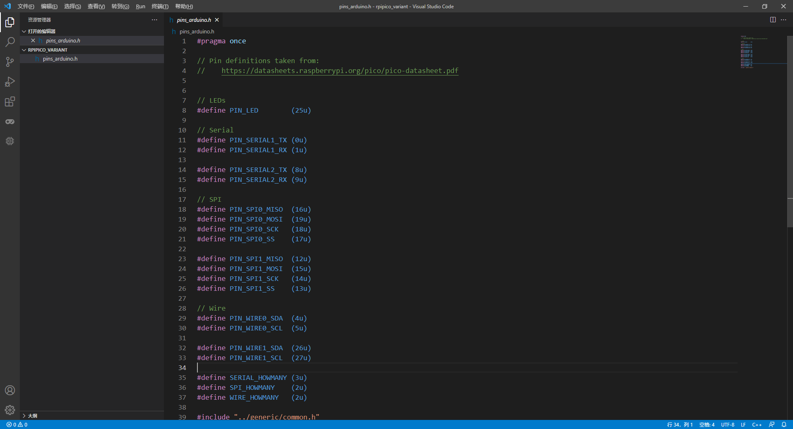
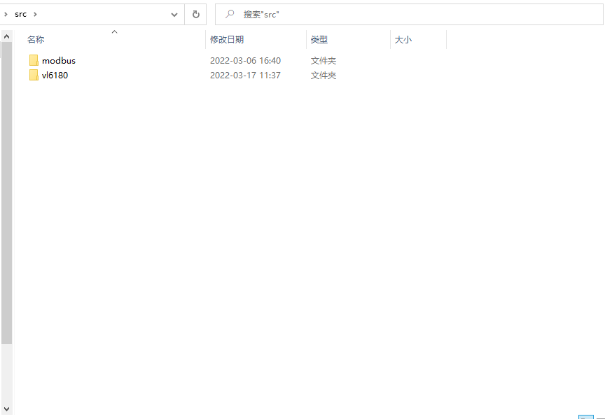
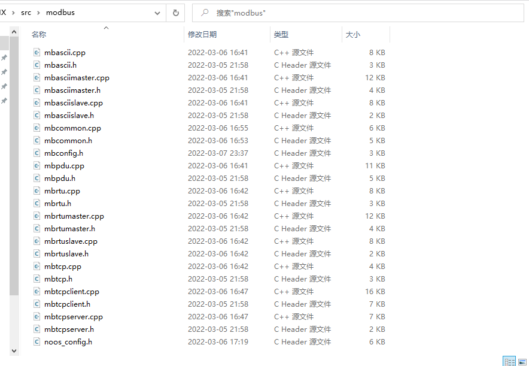
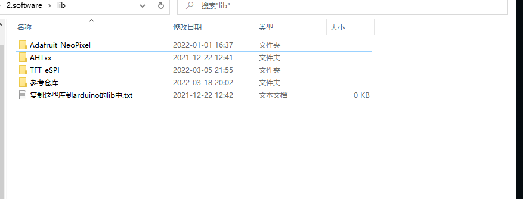
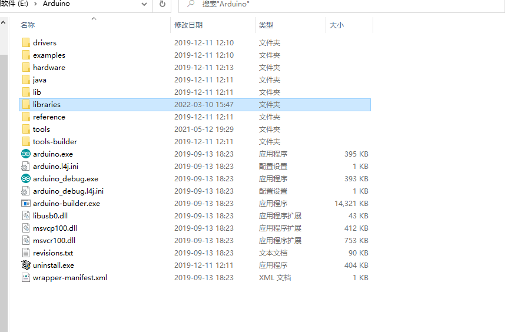

PICO-MAGIX环境配置

# 一、开发环境

## 软件开发环境下载配置

现在使用Arduino IDE来进行开发。具体的使用工具有下面的几个工具：

### 1.Arduino IDE

下载最新版。不要装在中文路径下面。安装JAVA等依赖。

我们主要使用Arduino IDE来进行工程编译，下载。

### 2.Vscode 

下载最新版。下载中文界面、C/C++插件等必要工具。

VScode用来进行编程。

## 环境配置的问题

### 1. vscode的输出中文乱码

如果你使用了VScode插件的版本的Arduino，碰到了编译出错的话，可以看下下面博客的解决办法。

这里为了没有这个错误，建议还是安装Arduino IDE，而不是从其他的地方安装插件。

参考了博客：https://blog.csdn.net/weixin_42225355/article/details/104906950

### 2.头文件包含问题

在VScode中我们只进行编写代码的工作，往往在vs里面会提示找不到相关头文件。

虽然现在没有什么好办法解决这个问题，但是他不影响后面我们编译、运行程序。VS对于我们来讲，他只是一个编写代码的工具。

### 3.文件夹创建方法

在写代码过程中，我们会将一类驱动放在一个文件夹中，使整个工程结构更加的清晰。

这里的说明在ArduinoIDE的环境中，创建相似的文件夹目录。

具体的方法：

- 首先创建文件夹src：这里我使用src文件夹做演示，在src中创建Led文件夹。

- 接着，我们把led.cpp和led.h放在src/Led文件夹中。

  ***注意***

  1.arduino ide使用c++后缀，里面代码可以完全使用c语言，也可以使用c++。但是要注意的是，新建的源文件一定要用cpp后缀。如果使用了c后缀，意思是一个c文件，ide会报错。

  2.文件夹的名字和Led和源文件的名字要有区别，不能完全一样，比如说上面的定义方法：文件夹名字：Led，源文件名：led.cpp。原因目前我还没有深入了解，这个可以给后续的同学研究。

- 在要使用的文件中引用这个文件夹中的头文件。

  使用#include “src/Led/led.h”来应用该文件。

在使用的时候例如下图中的是有工程文件夹，保存了一个src文件夹和其他的源文件：

src中包含了两个自定义的库文件夹，分别是Modbus和vl6180。

在modbus创建的源文件包括下面的部分。

在modbus中最好不要再有其他的文件夹，那样会增加自己的工作量。

# 二、开发板环境配置

## Arduino IDE开发板配置

1. 打开 Arduino IDE ， 文件->首选项.

2. 在“附加开发板管理器网址”中新启一行，添加:

    https://github.com/earlephilhower/arduino-pico/releases/download/global/package_rp2040_index.json

3. 点击OK关闭对话框.

4. 点击Tools->Boards->Board Manager in the IDE

5. 搜索 “pico” ，select “Add”。

图文教程点击这里：https://arduino-pico.readthedocs.io/en/latest/install.html#installing-via-arduino-boards-manager

## VS CODE编写文件

1.用VS CODE打开工程文件夹

2.编写代码。

## 引用库文件

在software的文件夹中，lib文件夹中包括了我们使用到的library，这里使用到的库有三个：

> 1. Adafruit_NeoPixel
> 2. AHTxx
> 3. TFT_eSPI

将这三个文件夹直接拷贝到arduino的安装路径下的libraries中，例如我的是e盘中的arduino：

### LAST Reference

参考了博客来进行C++的库的编写：

https://www.cnblogs.com/lulipro/p/6090407.html

使用的板卡官方wiki：

https://arduino-pico.readthedocs.io/en/latest/
